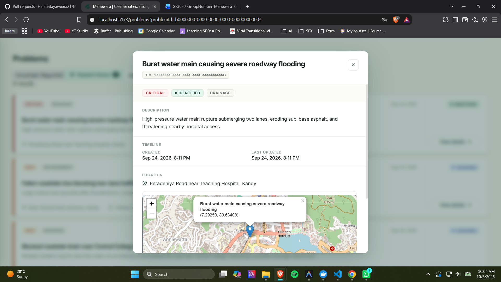
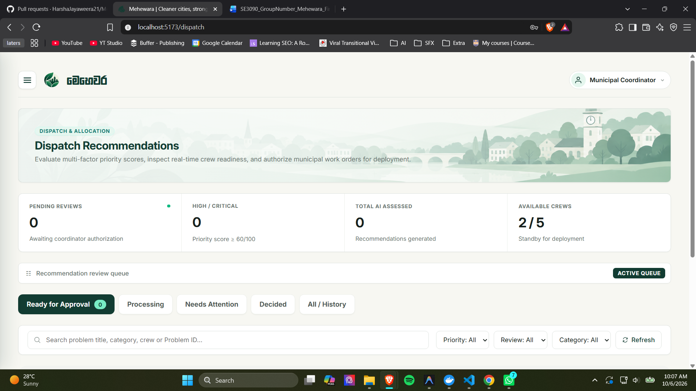
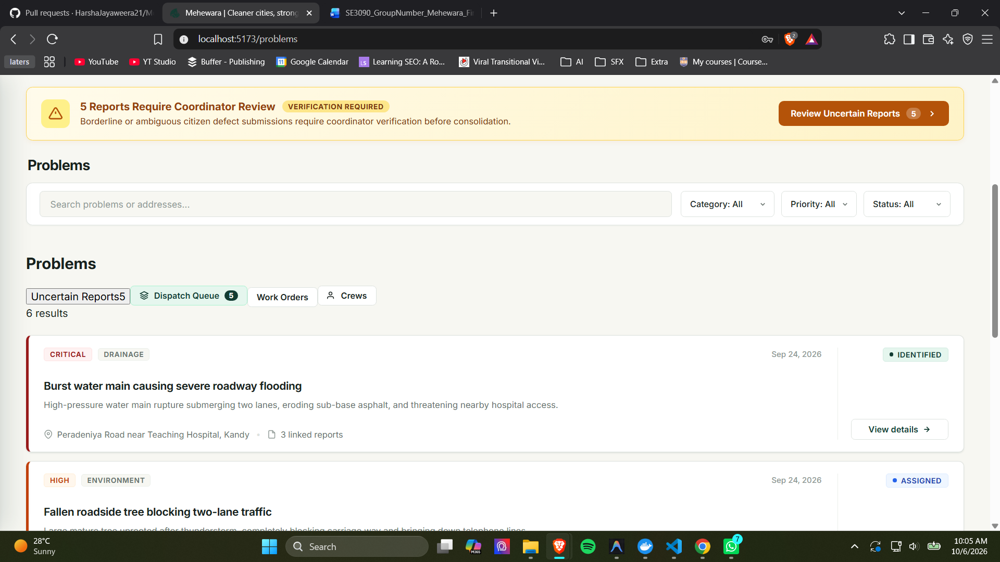
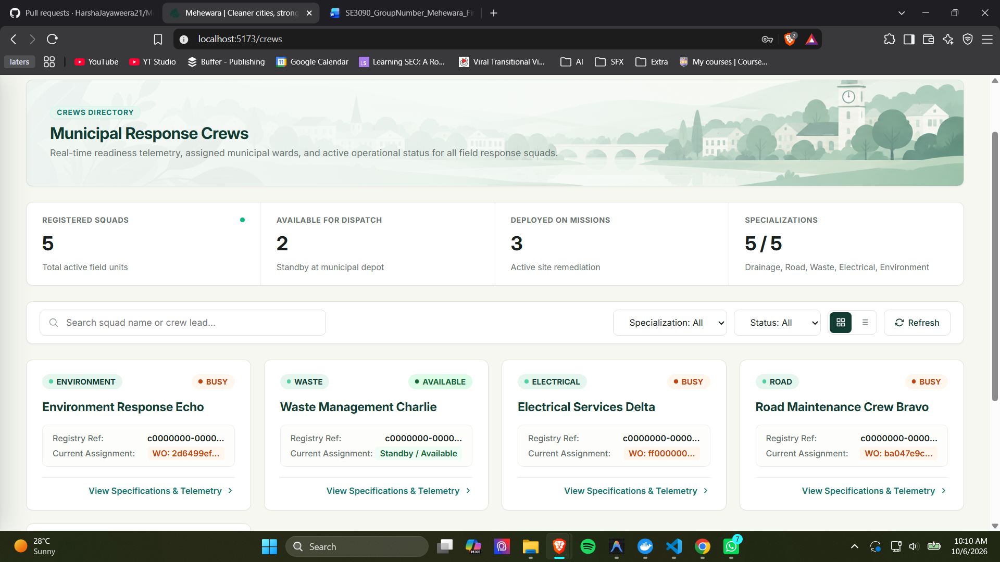
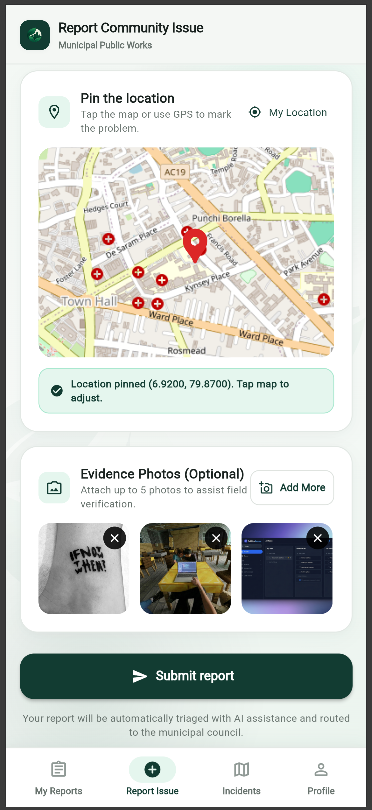
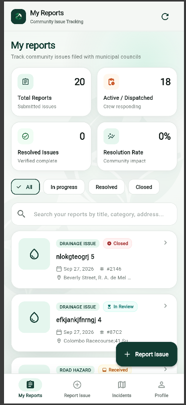
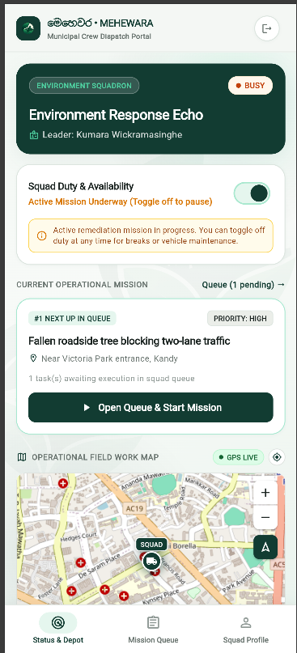
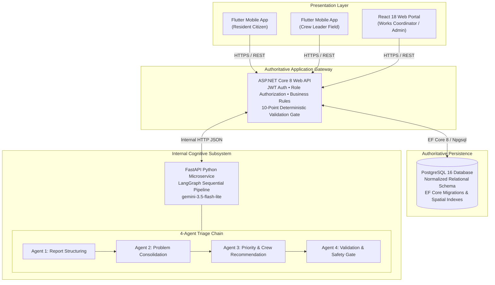

# Mehewara (මෙහෙවර)
### Intelligent Municipal Works & Autonomous Crew Dispatch Platform

[](https://github.com/HarshaJayaweera21/Mehewara/actions/workflows/ci.yml)


---

## 📌 Quick Links

[Overview](#-overview) • 
[Key Features](#-key-features) • 
[UI Preview](#-ui-preview) • 
[System Architecture](#-system-architecture) • 
[Tech Stack](#-tech-stack) • 
[Quick Start](#-quick-start) • 
[Test Accounts](#-pre-seeded-test-accounts) • 
[Running Tests](#-running-tests) • 
[Repository Structure](#-repository-structure) • 
[Contributors](#-team--contributors)

---

## 📖 Overview

Municipal councils face severe operational bottlenecks when responding to citizen-reported infrastructure hazards. Thousands of daily complaints arrive in unstructured, non-technical descriptions; many describe identical incidents (duplicate reporting), confuse visible symptoms with physical root causes, or lack accurate spatial context. Meanwhile, municipal field resources are constrained by specialized squads (`DRAINAGE`, `ROAD`, `WASTE`, `ELECTRICAL`, `ENVIRONMENT`) that cannot be interchanged. Dispatching the wrong squad wastes limited operational slots and delays hazard resolution.

**Mehewara (මෙහෙවර)** resolves this coordination and triage challenge. It provides an end-to-end civic operations platform that connects **citizen incident reporting** via mobile, an **autonomous 4-agent LangGraph cognitive triage pipeline**, a **central coordinator dispatch command center** on the web, and a **mobile field crew execution terminal**—enforcing strict human-in-the-loop (HITL) approval and deterministic validation before any physical crew is mobilized.

---

## ✨ Key Features

### 📱 Citizen Reporting Portal (Flutter Mobile)
* **Map & Geolocation Pinning:** Interactive OpenStreetMap/Nominatim location picker capturing precise latitude/longitude and reverse geocoded street addresses.
* **Incident Description & Photos:** Free-text hazard reports with optional photo evidence uploaded securely to Cloudinary.
* **Citizen Transparency:** Live lifecycle tracking (`PENDING` → `PROCESSING` → `ASSIGNED` → `RESOLVED`) and notifications when an incident is consolidated into a municipal problem.

### 🧠 Autonomous 4-Agent Cognitive Triage (FastAPI + LangGraph)
* **Agent 1 (Report Structuring):** Ingests raw citizen text, extracts observable symptoms, hazards, and affected assets without hallucinating unverified root causes.
* **Agent 2 (Problem Consolidation):** Evaluates semantic and spatial similarity to cluster redundant complaints into unified problem centroids, eliminating duplicate work orders.
* **Agent 3 (Prioritization & Squad Matching):** Computes objective severity scores (0–100) using a multi-factor risk model (`LOW`, `MEDIUM`, `HIGH`, `CRITICAL`) and deterministically matches the nearest available specialized squad.
* **Agent 4 (Validation & Safety Gate):** Applies invariant validation, checks squad availability, flags potential conflicts, and prepares recommendations for human approval.

### 💻 Coordinator Command Center (React 18 Web)
* **Operational Triage Dashboard:** Real-time visibility into incoming citizen complaints, consolidated problems, and pending AI recommendations.
* **Human-in-the-Loop (HITL) Controls:** Coordinators can **Approve**, **Edit**, **Regenerate** (with prompt feedback), or **Reject** squad dispatch proposals.
* **10-Point Deterministic Validation Gate:** ASP.NET Core enforces database invariants (squad availability, type matching, no overlapping assignments) immediately before work order generation.
* **Fleet Directory & Analytics:** Live status monitoring across all municipal squads (`AVAILABLE`, `BUSY`, `UNAVAILABLE`).

### 👷 Field Crew Terminal (Flutter Mobile)
* **Squad Identity & Readiness:** Crew leaders manage squad operational status and toggle on-duty availability.
* **Live GPS Telemetry:** Real-time location heartbeat streaming from field devices to municipal headquarters.
* **Mission Lifecycle Management:** View assigned work orders with emergency instructions, navigate to problem coordinates, start remediation (`IN_PROGRESS`), and submit completion notes.

---

## 🖼 UI Preview

Screenshots are organized in the [`screenshots/`](screenshots/) directory. Drop your exported screenshots into [`screenshots/web/`](screenshots/web/) and [`screenshots/mobile/`](screenshots/mobile/) to display them here.

### Web Operations Portal
| Coordinator Dispatch Triage | AI Recommendation & Action Modal |
| :---: | :---: |
|  |  |
| *Master-detail triage queue with priority score breakdown* | *Human-in-the-loop review: Approve, Edit, Reject, Regenerate* |

| Consolidated Problems View | Fleet Inventory & Squad Status |
| :---: | :---: |
|  |  |
| *Unified problems with grouped citizen reports* | *Municipal squad directory with real-time status badges* |

### Mobile Application
| Citizen Incident Reporting | Live Report Status Tracking | Crew Leader Status Banner | Assigned Mission Queue |
| :---: | :---: | :---: | :---: |
|  |  |  |  |
| *Map pin, photos & GPS capture* | *Transparent resolution lifecycle* | *Readiness & duty availability toggle* | *Field mission details & completion* |

---

## 🏛 System Architecture

Mehewara follows a strictly partitioned multi-tier architecture adhering to reference integration standards:



### Architectural Invariants & Boundary Rules
1. **Strict Client Boundary:** React and Flutter clients communicate **exclusively** with ASP.NET Core. The internal FastAPI AI service is never exposed to client applications.
2. **Authoritative State:** PostgreSQL is the single source of truth for all business entities (`reports`, `problems`, `crews`, `work_orders`, `workflow_events`).
3. **Deterministic Tool Execution (ADR-04):** Agent 3 queries allow-listed tools deterministically in Python before calling the LLM with structured Pydantic schemas, eliminating recursive function-calling loops and reducing inference latency.
4. **Human-in-the-Loop (HITL) Dispatch:** AI outputs are recommendations only. No physical work order can be created or squad mobilized without human coordinator approval.
5. **Atomic Validation Gate:** Before generating a work order, ASP.NET Core re-evaluates a 10-point checklist under database row-level locking (`FOR UPDATE`) to prevent race conditions and squad double-booking.

---

## 🛠 Tech Stack

| Tier | Technology | Version | Purpose |
| :--- | :--- | :--- | :--- |
| **Backend API** | ASP.NET Core Web API | 8.0 | Authoritative REST API, security, business logic, validation |
| **ORM / Data Access** | Entity Framework Core | 8.0 | Relational database mapping, migrations, query optimization |
| **Database** | PostgreSQL | 16.x | ACID persistence, spatial indexing, audit trails |
| **Web Frontend** | React / TypeScript / Vite | 18.x / 5.x | Coordinator triage dashboard, fleet inventory, review modals |
| **Mobile App** | Flutter / Dart | 3.x / 3.47+ | Cross-platform mobile for citizens (reports) & crews (field jobs) |
| **AI Orchestration** | LangGraph / FastAPI | Python 3.12 | Multi-agent sequential pipeline, state transitions, allow-listed tools |
| **LLM Provider** | Google Gemini API | 3.5 Flash | Cognitive reasoning, hazard extraction, and structured output |
| **Cloud Storage** | Cloudinary API | REST | Secure citizen report photo storage and CDN delivery |
| **Containerization** | Docker & Docker Compose | Latest | Multi-container development and production orchestration |
| **Reverse Proxy** | Nginx | 1.27-alpine | Reverse proxy, SSL termination, and static frontend hosting |
| **CI/CD** | GitHub Actions | v4 | Automated build, lint, and test validation across all 4 tiers |

---

## 🚀 Quick Start

### Prerequisites
* [.NET 8.0 SDK](https://dotnet.microsoft.com/download/dotnet/8.0)
* [Node.js 22 LTS](https://nodejs.org/) & npm
* [Flutter 3.x SDK](https://flutter.dev/docs/get-started/install)
* [Python 3.12](https://www.python.org/) & [uv package manager](https://github.com/astral-sh/uv)
* [Docker Desktop](https://www.docker.com/)

---

### Option A: Docker Compose (Quickest)

To spin up the PostgreSQL database container:

```bash
docker compose -f docker/compose.yml up -d
```

*(For full production containerized stack with Nginx, see [docker/compose.prod.yml](docker/compose.prod.yml)).*

---

### Option B: Local Multi-Service Development

Run services in the recommended startup order:

#### 1. Database & Migrations
Ensure PostgreSQL is running locally on port `5432` (or via Docker), then apply EF Core migrations:
```bash
cd backend/Mehewara.API
dotnet ef database update
```
*Note: `DbSeeder.cs` automatically seeds initial roles, users, and 5 specialized squads on first launch.*

#### 2. AI Microservice (FastAPI + LangGraph)
```bash
cd ai-service/mehewara-ai
cp .env.example .env          # Configure your GEMINI_API_KEY
uv sync --frozen --extra dev
uv run uvicorn main:app --reload --port 8000
```
*API docs available at: `http://localhost:8000/docs`*

#### 3. ASP.NET Core Backend API
```bash
cd backend/Mehewara.API
dotnet run
```
*Swagger UI available at: `http://localhost:5000/swagger` or `https://localhost:5001/swagger`*

#### 4. React Web Application
```bash
cd web/mehewara-web
npm install
npm run dev
```
*Web portal running at: `http://localhost:5173`*

#### 5. Flutter Mobile Application
```bash
cd mobile/mehewara_mobile
flutter pub get
flutter run
```
*Or run in browser during development: `flutter run -d chrome --web-port=5175`*

---

## ⚙️ Configuration & Environment Variables

Copy `.env.example` templates in each respective folder:

| Component | File | Key Variables | Description |
| :--- | :--- | :--- | :--- |
| **Backend** | `backend/Mehewara.API/appsettings.json` | `ConnectionStrings:DefaultConnection`<br>`Jwt:Key`<br>`AiService:BaseUrl`<br>`Cloudinary:*` | Database connection string, JWT signing secret, internal AI URL, Cloudinary credentials |
| **AI Service** | `ai-service/mehewara-ai/.env` | `GEMINI_API_KEY`<br>`GEMINI_MODEL`<br>`DOTNET_API_BASE_URL` | Google Gemini key, model (`gemini-3.5-flash-lite`), backend callback URL |
| **Web Portal** | `web/mehewara-web/.env` | `VITE_API_BASE_URL` | ASP.NET Core Web API URL (`http://localhost:5000/api`) |
| **Mobile App** | `mobile/mehewara_mobile/.env` | `API_BASE_URL`<br>`NOMINATIM_BASE_URL` | Backend API URL, OpenStreetMap reverse geocoding endpoint |

---

## 👥 Pre-Seeded Test Accounts

The system includes pre-configured accounts seeded via [`DbSeeder.cs`](backend/Mehewara.API/Data/DbSeeder.cs) for rapid testing and evaluation:

| Role | Email Address | Password | Permissions & Access |
| :--- | :--- | :--- | :--- |
| **Municipal Coordinator** | `admin@mehewara.gov.lk` | `Admin@123` | Full administrative access, triage dashboard, HITL dispatch approval |
| **Citizen (Resident)** | `resident@example.com` | `Resident@123` | Mobile resident portal, incident submission, GPS map, tracking |
| **Drainage Crew Leader** | `crew.drainage@mehewara.gov.lk` | `Crew@123` | Drainage squad field operations, work orders, readiness status |
| **Road Crew Leader** | `crew.road@mehewara.gov.lk` | `Crew@123` | Road repair squad field operations, work orders, readiness status |
| **Waste Crew Leader** | `crew.waste@mehewara.gov.lk` | `Crew@123` | Waste management squad field operations, work orders, readiness status |
| **Electrical Crew Leader**| `crew.electrical@mehewara.gov.lk`| `Crew@123` | Electrical repairs squad field operations, work orders, readiness status |
| **Environment Crew Leader**| `crew.environment@mehewara.gov.lk`| `Crew@123` | Environmental/parks squad field operations, work orders, readiness status |

---

## 🧪 Running Tests

The test suite contains over **185+ automated tests** verifying every layer of the system:

```bash
# 1. Backend Tests (xUnit — Dispatch Gate, Crew Services, Integration)
dotnet test test/Mehewara.Tests.Member2/Mehewara.Tests.Member2.csproj
dotnet test test/Mehewara.Tests.Member3/Mehewara.Tests.Member3.csproj

# 2. Web Frontend Tests (Vitest + React Testing Library)
npm --prefix web/mehewara-web test

# 3. Mobile Tests (Flutter Unit & Widget Tests)
cd mobile/mehewara_mobile && flutter test

# 4. AI Service Tests (pytest — Agent Cognitive Evals, Golden Cases, Concurrency)
cd ai-service/mehewara-ai && uv run --frozen pytest
```

All test suites execute automatically in the [GitHub Actions CI Pipeline](.github/workflows/ci.yml) on pushes and pull requests to `dev` and `main`.

---

## 📁 Repository Structure

```
Mehewara/
├── .github/workflows/         # CI/CD pipelines (GitHub Actions ci.yml)
├── ai-service/                # Python FastAPI + LangGraph AI microservice
│   └── mehewara-ai/
│       ├── agents/            # Cognitive agents (Report, Consolidation, Priority, Validation)
│       ├── schemas/           # Structured Pydantic input/output contracts
│       ├── tools/             # Allow-listed deterministic tools
│       ├── workflow/          # LangGraph sequential graph topology
│       └── tests/             # Pytest cognitive evaluation test suites
├── backend/                   # ASP.NET Core 8 Web API backend
│   └── Mehewara.API/
│       ├── Controllers/       # RESTful API controllers (Reports, Problems, Crews, Dispatch, etc.)
│       ├── Data/              # EF Core AppDbContext, DbSeeder, Migrations
│       ├── DTOs/              # Strongly-typed request/response models
│       ├── Integrations/      # Cloudinary, internal AI client
│       ├── Models/            # Domain entities (User, Role, Report, Problem, Crew, WorkOrder)
│       └── Services/          # Core business services & 10-point validation gate
├── database/                  # SQL scripts & database migration history
├── docker/                    # Docker Compose configs & Nginx reverse proxy
├── docs/                      # Architectural documentation & technical specs
├── mobile/                    # Flutter cross-platform mobile application
│   └── mehewara_mobile/
│       ├── lib/features/      # Resident portal & Crew leader portal modules
│       ├── lib/core/          # Network, storage, theme, and location abstractions
│       └── test/              # Flutter unit and widget tests
├── screenshots/               # Visual UI captures (Web & Mobile galleries)
│   ├── web/                   # Web operations screenshots
│   └── mobile/                # Mobile application screenshots
├── test/                      # Backend xUnit test projects (Member 2, Member 3)
└── web/                       # React 18 + Vite + TypeScript web application
    └── mehewara-web/
        ├── src/pages/         # Dispatch triage, problems, crews, work orders pages
        ├── src/components/    # Common civic-tech design system components
        └── tests/             # Vitest component & form validation test suites
```

---

## 📐 Architecture Decision Records (ADRs)

| Record | Title | Summary & Technical Justification |
| :--- | :--- | :--- |
| **ADR-01** | **Clustering vs. Triage Boundary** | AI generates semantic clusters; ASP.NET Core retains authoritative problem creation and coordinator review. |
| **ADR-02** | **Report-Problem Association Strategy** | Many-to-many relationship via `report_problems` junction allowing safe re-clustering and correction. |
| **ADR-03** | **LangGraph Sequential Pipeline** | Structured linear DAG (`Agent 1 → Agent 2 → Agent 3 → Agent 4`) orchestrated through a single unified workflow entrypoint. |
| **ADR-04** | **Deterministic Tool Execution** | Avoids LLM-driven ReAct AFC recursion bugs by executing allow-listed tools programmatically in Python and injecting results into the system prompt. |
| **ADR-05** | **Agent 1 Passthrough Schema** | Downstream agents read normalized facts directly from workflow state without re-invoking previous agents. |
| **ADR-06** | **Safe Failure & Approval Invariants** | Unrecognized or uncertain recommendations fail gracefully; human coordinator retains exclusive dispatch authority. |

---

## 👨‍💻 Team & Contributors

| Member | Primary Ownership | Component Responsibilities | GitHub Profile |
| :---: | :--- | :--- | :---: |
| **Member 1** | **Report & Intake Management** | Citizen mobile reporting with GPS/photos, Report REST APIs, PostgreSQL `reports` schema, Agent 1 (Report Structuring). | [@HarshaJayaweera21](https://github.com/HarshaJayaweera21) |
| **Member 2** | **Problem Identification & Consolidation** | Coordinator problem explorer, consolidation APIs, `problems` & `report_problems` schema, Agent 2 (Problem Consolidation). | [@nuwandh](https://github.com/nuwandh) |
| **Member 3** | **Prioritization & Crew Dispatch** | Coordinator dispatch triage dashboard & action modals, Crew APIs, `crews` schema, Agent 3 (Priority & Crew Matching). | [@ssshanaka](https://github.com/ssshanaka) |
| **Member 4** | **Work Orders & Crew Execution** | Crew mobile field execution terminal, WorkOrder APIs, `work_orders` & `approval_history`, Agent 4 (Validation & Safety). | [@bimsara2003](https://github.com/bimsara2003) |

---

## 🌐 Live System & Deployment

The production system is deployed on a dedicated cloud host (`51.79.240.142`) orchestrated via Docker Compose with an Nginx reverse proxy gateway.

| Resource | URL / Access Path | Description & Access Notes |
| :--- | :--- | :--- |
| **Coordinator Web Portal** | [http://51.79.240.142/](http://51.79.240.142/) | Production React 18 web application |
| **Swagger UI** | [http://51.79.240.142/swagger/index.html](http://51.79.240.142/swagger/index.html) | Interactive API exploration and live testing |
| **API Health Endpoint** | [http://51.79.240.142/health](http://51.79.240.142/health) | System health status (`HTTP 200 OK` JSON body) |
| **OpenAPI Definition** | [http://51.79.240.142/swagger/v1/swagger.json](http://51.79.240.142/swagger/v1/swagger.json) | Raw OpenAPI v1 JSON schema definition |
| **Business API Base** | `http://51.79.240.142/api` | Reverse-proxied gateway; protected calls require Bearer JWT |
| **Mobile Android APK** | [Download APK (Google Drive)](https://drive.google.com/drive/folders/1rwlvVtLey2Kk6OtXGyAplTVokG1qjRf?usp=sharing) | Runnable Flutter Android release build |
| **Source Repository** | [GitHub Repository](https://github.com/HarshaJayaweera21/Mehewara) | Source code, branches, and execution evidence |
| **AI Subsystem (Internal)** | `http://ai-service:8000` | Internal container network; protected from direct public access |
| **Database (Internal)** | `postgres-db:5432` | Internal PostgreSQL container connection |
| **System Demonstration** | [Watch Video Demonstration](https://youtu.be/example-mehewara-demo) | 10-minute end-to-end recorded system walkthrough |

---

## 📜 License

This project is licensed under the MIT License — see the [LICENSE](LICENSE) file for details.
